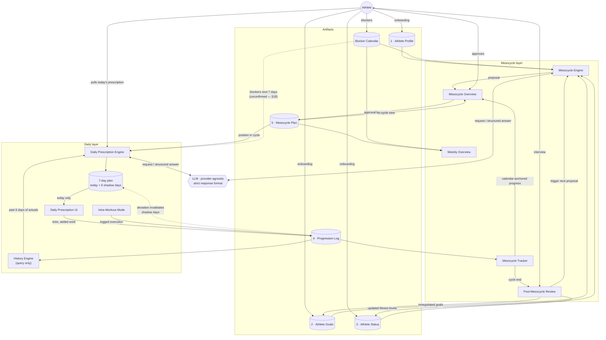

# Product Requirements Document

## Cadentic — v1.1

Longevity-first structured training system (MVP)

**Version:** 1.1 · **Date:** 2026-08-25 · **Supersedes:** `cadentic_prd_v_1.md`

---

## Changelog v1 → v1.1

- System decomposed into named **artifacts** and **modules** with a system diagram (§5).
- Both engines — Mesocycle Engine and Daily Prescription Engine — are **LLM-backed**, with a strict response-format contract (§8).
- §7 rewritten: **execution-history-driven daily prescription is IN scope for MVP.** What is descoped is adaptation based on regeneration/recovery data (wearables, sleep, HRV) — v1 had conflated the two.
- Daily prescription is **pull-only**. The morning push notification (v1 §11) is removed.
- The daily engine always prescribes a **7-day window (today + 6 shadow days)**; only today is shown. Shadow days are stashed and recalculated only when logged execution deviates from the plan (§12).
- Mesocycle duration is **decided by the LLM** and is never modified in the app (§9). Whether v1's 4–16 week band should constrain the LLM is an open question (§18).
- **Tempo removed** from prescription attributes. Optional setup notes added (angles, seat/machine settings).
- Canonical name fixed: **"Mesocycle Overview"** — replaces both "Mesocycle Overview Screen" (v1 §10) and "Meso Presentation Module". (Name picked by Claude under the owner's delegation; swap freely, then stick to one.)
- Post-mesocycle fitness re-determination specified: **athlete interview**; result updates Athlete Status (§14).
- Mesocycle position is **calendar-anchored** — no shifting based on athlete adherence (§14).
- v1 §7.2's "standard build-to-deload ratios defined at onboarding" is superseded: phase structure and deload timing are part of the LLM-generated Mesocycle Plan (§5.2).
- v1 §7.1's "Week 1 Baseline" is not carried over as-is; week-1 handling under the history-driven model is an open question (§18).

---

## 1. Executive Summary

Cadentic is a longevity-focused fitness app that delivers structured training programs organized across three layers:

1. Mesocycle
2. Weekly structure
3. Daily prescription

For MVP, mesocycles are fixed once approved. Adaptation is limited to daily prescriptions informed by the athlete's logged execution — including overrides and added work — and, between cycles, explicit athlete feedback through the review interview. The mesocycle structure itself never adapts.

Plan generation is not deterministic: both the mesocycle and the daily prescription are produced by an LLM from the system's artifacts, returned in a strict machine-readable format, and rendered by deterministic GUI fixtures.

Cadentic is not a lifestyle correction tool, not a behavioral enforcement system, and not a recovery diagnostic engine. It supports disciplined athletes by reducing planning overhead while preserving full athlete agency.

Core principle:
**Structure first. Light autoregulation second. Athlete agency always.**

---

## 2. Problem Statement

Most fitness apps either:

- Provide static programs with no flexibility
- Overpromise adaptive intelligence but deliver badly designed plans

Disciplined athletes need:

- Clear mesocycle structure
- Transparent progression
- Minimal planning friction
- Sensible day-to-day adjustments when sessions deviate

Cadentic solves this by combining structured programming with bounded autoregulation.

---

## 3. Product Vision

Cadentic becomes a structured AI programming engine for longevity-minded athletes who:

- Value long-term performance
- Accept personal responsibility for sleep and lifestyle
- Want high-quality programming without constant manual planning

Cadentic optimizes programming quality, not human behavior.

---

## 4. Target User

Primary:

Any athlete who wants to balance strain with a longevity- and well-being-first approach (team sports, lifters, endurance athletes, longevity athletes).

---

## 5. Core Product Architecture

### 5.1 Planning Hierarchy

1. **Mesocycle:** generated by the Mesocycle Engine; duration decided by the LLM (whether v1's 4–16 week band should constrain it is open — §18); locked on approval; no structural adaptation during the cycle in MVP.
2. **Weekly structure:** distribution of strength, endurance, mobility, recovery, game/team days, rest — defined by the mesocycle as day types plus intra- and inter-week progression. The mesocycle layer never prescribes exercises.
3. **Daily prescription:** exact workout definition — exercises, sets, reps, weights, rest, duration, optional setup notes.

### 5.2 Artifacts

The artifact split is a **business decomposition by change cadence**, not a storage design. Technically this can be one database, separate tables, or anything else — that is an engineering decision.

| # | Artifact | Content | Change dynamics |
|---|----------|---------|-----------------|
| 1 | **Athlete Profile** | Age, sex, height, weight | Near-static; realistically only weight changes |
| 2 | **Athlete Goals** | Long-term goals, performance priorities, trade-offs | Adapt over time, but **locked per mesocycle** — renegotiated only between cycles |
| 3 | **Athlete Status** | Current fitness levels; experience level; injuries and constraints | Changes slowly over time, hopefully from bad to good; re-determined between cycles |
| 4 | **Progression Log** | Actual execution: sets, reps, weights, duration; optional free-text setup notes (angles, seat/machine settings — informational only, not used for progression) | Appended every training day; athlete can log extra sets or extra exercises beyond the prescription |
| 5 | **Mesocycle Plan** | The approved LLM-generated cycle: duration, phase structure, weekly distribution, day types, intra-/inter-week progression, deload timing | Locked on approval; fixed for the whole cycle |

**Blocker Calendar** (supporting store): one-time and recurring blockers — game days, team practices, other commitments — each with a strain attribute (light / medium / hard). Consumed by the Mesocycle Engine; presumed to also feed the Daily Prescription Engine's 7-day window, but this is **unconfirmed** (§18). Whether this is a calendar service, a separate table, or something else is an engineering decision.

Placement note: injuries/constraints and experience level are assigned to Athlete Status because they evolve the way status does (slowly, ideally improving). This placement was delegated to whatever makes sense and can be revisited.

### 5.3 Modules

| Module | Kind | Responsibility |
|--------|------|----------------|
| **Mesocycle Engine** | LLM-backed | Gathers Athlete Profile + Goals + Status + Blocker Calendar, sends them to the LLM, receives the mesocycle in the strict response format, produces the Mesocycle Plan. Prescribes day types and intra-/inter-week progression — never exercises. |
| **Mesocycle Overview** | Deterministic GUI | Renders the Mesocycle Plan from fixed GUI fixtures/rules. Pre-approval it presents the proposal; in-cycle it shows current phase, build/deload position, completion percentage, and adaptation focus. |
| **Weekly Overview** | Deterministic GUI | Renders the current week from the Mesocycle Plan and the Blocker Calendar: week number, training distribution, intensity blocks, blockers, rest days (§10). |
| **Mesocycle Tracker** | Deterministic | Consumes the Progression Log to report progress through the cycle. Position is calendar-anchored (§14). At cycle end, triggers the Post-Mesocycle Review. |
| **Post-Mesocycle Review** | AI-based interview | Adherence evaluation plus athlete interview (§14); re-determined fitness levels update Athlete Status, renegotiated goals update Athlete Goals. Which module conducts it is an engineering decision. |
| **Daily Prescription Engine** | LLM-backed | On athlete request, serves today's plan. Calls the LLM only when no valid stashed day exists — first pull, or after a logged deviation invalidated the stash (§12). It then assembles the past 6 days of actuals, the position in the Mesocycle Plan, and (unconfirmed — §18) the blockers in the coming week, and receives a 7-day plan (today + 6 shadow days). Today is presented; shadow days are stashed. |
| **Daily Prescription UI** | Deterministic GUI | Shows today's prescription. Athlete ticks items done / not done and can add sets or exercises. Writes to the Progression Log. |
| **Intra-Workout Mode** | Deterministic GUI | Live session screen per §13, including rest timer. |
| **History Engine** | Query layer only | Assembles Progression Log data for the Daily Prescription Engine. Performs **no analytics of its own** — all analysis happens in the LLM. |

### 5.4 System Diagram

---

## 6. Core System Inputs (MVP)

### 6.1 Static Inputs

- Age, sex, height, weight, experience level, current fitness level
- Injuries and constraints
- Long-term goals, performance priorities, trade-offs
- Weekly or one-time blockers (game days, team practices) with strain attribute light/medium/hard

### 6.2 Dynamic Inputs

- Logged sets, reps, weights, duration, session completion status
- Extra sets or exercises the athlete added beyond the prescription
- Missed sessions
- Sleep, HRV, RHR, and wearable data are **excluded** from MVP adaptive logic

---

## 7. Adaptive Logic (MVP scope)

**In scope:**

- Every daily prescription is informed by the past 6 days of logged execution. Missed or deviating sessions are visible to the Daily Prescription Engine, and the LLM compensates within its 7-day window — always inside the constraints of the locked Mesocycle Plan.
- Shadow-day recalculation on deviation (§12).

**Descoped:**

- Adaptation based on regeneration/recovery data — Whoop, Google Health, sleep, HRV, RHR. This is the adaptive layer deferred to post-MVP, **not** the execution-history feedback above.
- Any structural change to the running mesocycle. The cycle's duration, phases, and weekly distribution never change mid-cycle.

**Open:** week-1 handling. v1 §7.1 described a baseline week (no adaptation, collect execution patterns); how week 1 behaves under the history-driven model is not yet decided (§18).

---

## 8. LLM Integration Requirements

- **Provider-agnostic.** GPT-class model assumed; the provider must be swappable without product impact.
- **Strict response format.** The app requests each answer in a defined machine-readable format (JSON presumed).
- **Format enforcement.** If a response comes back malformed, the app re-requests it in the specified format. The plan-rendering surfaces never display free text from the model (conversational surfaces — the goal interview, the post-mesocycle review — are chat by nature).
- **Deterministic presentation.** All GUI surfaces (Mesocycle Overview, Weekly Overview, Daily Prescription UI) render structured data through fixed fixtures/rules. The intelligence is non-deterministic; the display is not.

---

## 9. Onboarding Flow

### Step 1: Base Data

Collect age, sex, height, weight, experience level, current fitness level → Athlete Profile, Athlete Status.

### Step 2: Goal Interview

Conversational agent chat flow to define → Athlete Goals (and injury/constraint input → Athlete Status):

- Long-term goals ("I want to dunk and I want elite-level endurance")
- Performance priorities ("endurance is more important than dunking")
- Trade-offs ("I want longevity first, so pushing into unhealthy territory to max performance is unacceptable")
- Injuries ("I have a dislocated disk in the lower back and I have ankle instability")
- Practices ("I want to train in the gym, I have access to an Olympic lifting area, I train endurance in the pool")

### Step 3: Blockers

Game days, team practices, or other blockers → Blocker Calendar. One-time or recurring. Each event carries a strain attribute (light/medium/hard) as a constraint for planning.

### Step 4: Mesocycle Proposal

The Mesocycle Engine generates the first mesocycle: duration, phase structure, weekly distribution, planned deload timing.

- Duration is decided by the LLM. The app does not modify it — if the LLM prescribes 8 weeks, it is 8; if 12, then 12. (Whether to constrain the LLM to v1's 4–16 week band, and what to do with an out-of-band answer, is open — §18.)
- The proposal is rendered in the Mesocycle Overview.
- The athlete-modification / negotiation flow after "Ask for changes" is **parked** (§18).

Onboarding ends when the mesocycle is approved. Approval locks the Mesocycle Plan.

---

## 10. Weekly Overview

Displays:

- Current week number
- Training distribution (which workout type on which day)
- Planned intensity blocks
- Game days, team practice days, other blockers
- Rest days

---

## 11. Mesocycle Overview

Canonical name for the surface previously called "Mesocycle Overview Screen" and "Meso Presentation Module" (name picked by Claude under the owner's delegation) — one surface, two moments:

**As proposal (pre-approval):** duration, phase structure, weekly distribution, deload timing.

**In cycle:** current phase, build/deload position, completion percentage, focus of adaptation (e.g. strength, endurance, power, recovery).

---

## 12. Daily Prescription

**Pull-only.** The prescription is computed when the athlete requests it. No push notification.

**7-day window.** The engine always plans the next 7 days including today, but presents only today. The 6 future days are *shadow days*: they exist so each day is prescribed in weekly context — a single day planned in isolation would produce a greedy, short-sighted algorithm. Together with the 6 days of history behind, the engine always reasons over a full rolling window.

**Shadow-day lifecycle:**

- If logged execution matches the plan, the next day's pull serves the stashed shadow day — no recalculation, no LLM call.
- If the athlete logs a deviation from the daily plan, the shadow days (n+1 … n+6) are invalidated and the next pull triggers a full 7-day recalculation.

**Displayed per exercise:**

- Sets, reps, weights, rest, duration
- Optional setup notes (angles, seat/machine settings) — informational only

Tempo is not prescribed.

**Athlete agency:** the athlete retains full override control — items can be skipped, and sets or entire exercises can be added. Everything logged lands in the Progression Log and informs subsequent prescriptions.

---

## 13. Intra-Workout Mode

Session screen displays:

- Completed exercises and sets
- Current exercise
- Target sets and reps, target load, current set number
- Rest timer

Athlete logs actual execution.

If the session ends early, the system records partial completion and uses it as input for the next prescription. If the athlete stops logging, by the next day the app assumes training stopped where logging stopped and prescribes based on that.

---

## 14. Post Mesocycle

**Cycle end is calendar-anchored.** The mesocycle ends on its planned date regardless of adherence. Position within the cycle never shifts based on what the athlete did or missed.

At completion the system:

- Evaluates adherence (completion rate) from the Progression Log
- **Interviews the athlete**: how they felt, whether more or less would have been right — this interview is how fitness levels are re-determined
- Reaffirms the longevity stance: doing more than the prescribed and negotiated volume could be slightly beneficial for performance — which is what pros strive for — but is detrimental to longevity

Outcomes:

- Updated fitness levels are written to **Athlete Status**
- **Athlete Goals** may be renegotiated — this is the only moment goals change
- The Mesocycle Engine proposes the next cycle from the updated artifacts. Negotiation of that proposal is parked, same as at onboarding (§18)

---

## 15. Explicit Non-Goals (MVP)

- No wearable integration
- No HRV-, sleep-, or regeneration-based adaptation
- No probabilistic fatigue modeling
- No behavioral enforcement (not even a human coach can achieve this)
- No mid-cycle structural changes to the mesocycle
- No in-app modification of the LLM-decided mesocycle duration
- No push notifications for the daily prescription (pull-only)

---

## 16. Future Exploration (Post MVP)

- Structured CNS load modeling
- Wearable integration (Whoop, Google Health) and regeneration-based adaptation
- Probabilistic adaptive layer
- Mesocycle-level adaptation
- Performance trend inference

---

## 17. Engineering Notes (non-binding)

Recommendation, not a business requirement: LLM calls should go through a thin backend service rather than directly from the client — the API key cannot ship inside the app, and the backend is the natural home for the format-retry loop (§8), prompt versioning, and provider swapping. The current local stub (`android/.../domain/Engine.kt`) is already built to be swapped for a server call.

---

## 18. Open Questions

- **Deviation threshold:** currently *any* logged deviation invalidates the shadow days and triggers recalculation. Is a materiality threshold wanted (e.g. small weight differences don't count), or is "any deviation" fine?
- **Blockers → Daily Prescription Engine:** the draft presumes the engine sees the Blocker Calendar for its 7-day window (a game day tomorrow should shape today's session) — not yet confirmed by the owner.
- **Mesocycle duration bounds:** the LLM decides the duration unconditionally. Should v1's 4–16 week band be kept as a constraint in the prompt, and what happens if the answer falls outside it?
- **Week 1:** v1 described a baseline week (no adaptation, collect execution patterns). Under the history-driven model, does week 1 need special handling, or does the engine simply prescribe from the plan while the log is empty?
- **Negotiation flow** after "Ask for changes" on the mesocycle proposal — parked, undesigned.
- **Real league-calendar import** for game-day blockers — parked.
- **Dark mode** — parked.
