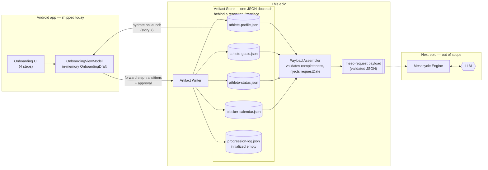

# Epic 1: Athlete Data Artifacts

**Parent doc:** `design_handoff_cadentic_onboarding/cadentic_prd_v_1_1.md` (§5.2 artifacts, §6 inputs, §9 onboarding)
**Status:** implemented (2026-08-26), then amended — the blocker calendar's third kind (`fixtures`) was dropped; see the sketch note. Revised after implementor review — verdict *agree with changes*, all findings folded in; the owner question is resolved and the open points are answered (both at the bottom).

## Goal

> Have all data we need to give to the LLM so that a proper mesocycle can be created.

Everything the Mesocycle Engine needs already gets captured by the shipped 4-step onboarding — base data, self-assessment, experience, priorities, lane, injuries, blockers — with one PRD divergence to note: the PRD's goal interview also named free-text long-term goals ("I want to dunk"); the shipped wizard captures ranked priorities and the lane instead (owner question at the bottom). But it all lives in the in-memory `OnboardingDraft` (`android/.../domain/Model.kt`): kill the process and it's gone, and the future Mesocycle Engine would have to read UI state. This epic turns that captured data into durable, validated **artifacts** (e.g. JSON documents) and ends with a single assembled, validated **meso-request payload** — the exact input the Mesocycle Engine will later send to the LLM.

**Definition of done:** with the app process restarted in between, a complete meso-request payload can be assembled from persisted artifacts alone — no UI state involved — and validation names any missing piece.

## Scope

**In:** artifact schemas, persistence, write-points from onboarding, hydration on launch, payload assembly + completeness validation. ViewModel and wiring changes needed for persistence/hydration are in scope.
**Out:** the LLM call and Mesocycle Engine (next epic), visual/design changes, Mesocycle Plan persistence (next epic — only the minimal lock snapshot in story 3), backend/sync (artifacts are on-device for MVP), daily prescription and progression *writing* (the log is only initialized here), equipment/facilities data (meso level prescribes no exercises — PRD §5.1; revisit in the daily-prescription epic).

Seeded persona data (demo fixtures, default injuries/priorities from `Engine.kt`'s `Seed`) is persisted as-is for MVP; seeding must run **only when no blocker-calendar artifact exists yet** — otherwise every launch would duplicate seeded fixtures into the persisted calendar.

## Proposed architecture — for implementor review

Proposal, not a mandate (PRD §5.2: storage is engineering's call): **one JSON document per artifact, on-device, behind a repository interface** — same swap-for-server philosophy as the `Engine.kt` stub. Room/DataStore are acceptable alternatives if the implementor prefers; the artifact *schemas* and the *payload contract* are the binding part, the storage tech is not.



### Mapping: existing Kotlin model → artifacts

The PRD decomposes artifacts by *change cadence*, and the current code groups fields differently. The implementor may keep the Kotlin classes as-is and map at serialization, or refactor — the artifact boundary is what's binding.

| Existing code | Artifact | Note |
|---|---|---|
| `Profile.age / sex / heightCm / weightKg` | **athlete-profile.json** | Code holds age/height/weight as `String` (UI state); the artifact stores numbers — conversion is a validation concern |
| `Profile.assessment` (per-category `Rating` or skipped) | **athlete-status.json** | Ratings are *status* even though the code nests them in `Profile`. Skipped rating → `null` (unknown) |
| `Profile.experience` | **athlete-status.json** | PRD §5.2 places experience in Status; stored as the label string for MVP |
| `OnboardingDraft.injuries` | **athlete-status.json** | Free-text list, captured via chips on the Priorities screen |
| `OnboardingDraft.priorities / focusCount / lane` + `dontCare` exclusions | **athlete-goals.json** | `dontCare` is a *goals* exclusion, not a status fact — even a rated category can be excluded |
| `Constraints` (recurring, one-offs; stable `id`s — `fixtures` and `fixtureSourceLabel` removed in the amendment below) | **blocker-calendar.json** | Two identical-looking blockers must stay distinct (see `Model.kt` comment) — but the in-memory `Ids` counter resets per process, so durability needs a persisted high-water mark or UUID re-keying (story 4, open point 5) |
| — (new) | `athlete-goals.json → lockedForCycle` | Lock snapshot minted at approval from the in-memory `Proposal` (story 3) |
| — (new) | **progression-log.json** | Schema defined now, initialized empty; written by the daily-tracking epic |
| — (gap) | *(not captured)* | Free-text long-term goals (PRD §5.2 row 2): the shipped wizard captures ranked priorities + lane instead — **owner confirmed** this stands in for MVP; PRD §5.2 and §9 carry the note |

### Artifact sketches

Every artifact carries `schemaVersion` and `updatedAt`.

```json
// athlete-profile.json — inputs are digit-only today (integer-valued);
// weightKg is decimal-typed for forward compatibility
{ "schemaVersion": 1, "updatedAt": "…", "age": 27, "sex": "MALE", "heightCm": 191, "weightKg": 88.0 }
```

```json
// athlete-status.json
{ "schemaVersion": 1, "updatedAt": "…",
  "experience": "Advanced — 5–10 years",
  "selfAssessment": { "CARDIO": "MID", "STRENGTH": "MID", "EXPLOSIVENESS": "LOW", "HYPERTROPHY": null },
  "injuries": ["Lower-back disc (L4/L5)", "Right ankle instability"] }
```

```json
// athlete-goals.json — focusCount is the EFFECTIVE value: always coerced to
// 1..min(MAX_FOCUS_COUNT, priorities.size) at serialization, so an impossible
// state (focusCount 2 with one priority) can never reach the payload
{ "schemaVersion": 1, "updatedAt": "…",
  "lane": "LONGEVITY",
  "priorities": ["CARDIO", "EXPLOSIVENESS", "STRENGTH"],
  "focusCount": 2,
  "excluded": ["HYPERTROPHY"],
  "lockedForCycle": null }
// at approval, lockedForCycle becomes a snapshot from the in-memory Proposal:
// { "approvedAt": "…", "startDate": "2026-09-01", "endDate": "2026-10-26" }
```

```json
// blocker-calendar.json — timeRange is OPAQUE free text (consumers must not
// parse it); days serialized in canonical sorted order
//
// AMENDED after implementation (2026-08-26, owner): the third kind — `fixtures`,
// with `fixtureSourceLabel` — is GONE. It existed for an imported league schedule
// that would stay authoritative on game dates; PRD §18 parks that import, so a
// game day is just a one-off the athlete owns. Schema is now v2; v1 stores migrate
// on read by folding fixtures into oneOffs. Stories 4 and 6 read accordingly:
// wherever they say "all three blocker kinds", there are two.
{ "schemaVersion": 2, "updatedAt": "…",
  "recurring": [ { "id": 1, "label": "Team practice", "days": ["TUESDAY","THURSDAY"], "timeRange": "19:00–20:30", "strain": "MEDIUM" } ],
  "oneOffs":   [ { "id": 2, "date": "2026-09-06", "label": "League game", "strain": "HARD" },
                 { "id": 3, "date": "2026-09-12", "label": "Travel day", "strain": "LIGHT" } ] }
```

```json
// progression-log.json — schema defined now, written later (PRD §5.2 row 4)
{ "schemaVersion": 1, "updatedAt": "…", "entries": [
  // { "date": "…", "exercise": "…", "sets": [ { "reps": 5, "weightKg": 100.0 } ],
  //   "durationMin": 45, "completed": true, "addedByAthlete": false, "notes": null }
] }
```

**Meso-request payload** = profile + goals + status + blocker calendar composed into one JSON object, plus a **`requestDate`** the assembler injects at composition time. The temporal anchor is not optional: the mesocycle is calendar-anchored (PRD §14) and fixtures carry absolute dates, so the LLM cannot lay phases and deloads against a September league game without knowing when the cycle starts — the `Engine.kt` stub already takes `today` as an input for exactly this reason. Cycle N>1 needs **no extra input**: the Post-Mesocycle Review updates Status and Goals in place (PRD §14), so later assembly is simply a re-read of the same four artifacts. (The Progression Log deliberately does *not* feed this payload — the PRD routes it to the History Engine and Mesocycle Tracker only.)

---

## User stories

### Story 0 — Artifact persistence foundation *(cross-cutting)*

As the **app**, I want a repository layer that persists each artifact as a versioned document and reads it back after process death, so that every later story writes through one mechanism and a server swap stays possible.

**Acceptance criteria**
- Each artifact is read/written through a repository interface; callers never touch files/DB directly.
- Every artifact carries `schemaVersion` and `updatedAt`; readers reject an unknown newer `schemaVersion` with a named error.
- **Write rule:** on every forward step transition and at approval, every artifact whose source fields changed since the last write is rewritten (rewriting all is acceptable — they are tiny). This covers back-then-forward edits: e.g. toggling a don't-care on step 1 after step 2 was completed mutates the priorities order, and the goals artifact must reflect it. Re-editing always updates the artifact, never a copy.
- Writes are atomic (temp-file + rename, or transactional DAO); the approval transition awaits the goals-lock write before the UI confirms — process death cannot lose an approval the athlete saw confirmed.
- Serialization is canonical (sets sorted, stable key order); the restart test asserts **structural equality of the parsed artifact**, not byte equality (`updatedAt` makes byte comparison wrong anyway).
- Storage tech (JSON files vs Room/DataStore) is the implementor's pick, recorded in the code.

### Story 1 — Persist Athlete Profile

As an **athlete**, I want my base data (age, sex, height, weight) saved durably when I complete onboarding step 1, so that I never re-enter it and every future cycle can use it.

**Acceptance criteria**
- Completing the Baseline step writes `athlete-profile.json` with numeric age/height/weight (string inputs converted; non-numeric input cannot reach the artifact).
- The artifact writer reuses the same validation as the UI's `stepValid` (ranges extracted to the domain layer) — no second source of truth that can drift.
- Artifact survives restart; re-edits follow the story 0 write rule.

### Story 2 — Persist Athlete Status

As an **athlete**, I want my self-assessed fitness ratings, experience level, and injuries saved as my current status, so that the mesocycle proposal reflects where I stand today.

**Acceptance criteria**
- Per-category rating persisted for all four categories; a skipped rating is stored as `null` (unknown), not omitted and not defaulted.
- Experience level and the full injuries list (as entered via chips, including additions/removals) are in the artifact.
- A category marked "don't care" still keeps its rating here if one was given — the exclusion itself lives in Goals (story 3).
- Write points: ratings + experience at step-1 completion, injuries at step-2 completion — the status artifact spans two steps; later edits follow the story 0 write rule.

### Story 3 — Persist Athlete Goals with lock-on-approval

As an **athlete**, I want my ordered priorities, focus count, lane choice, and excluded categories saved as my goals, and frozen once I approve a mesocycle, so that priorities provably never change within a cycle (PRD §5.2).

**Acceptance criteria**
- Artifact holds ordered priorities, the **effective** focus count (coerced to `1..min(MAX_FOCUS_COUNT, priorities.size)` — an impossible state can never be serialized), excluded (`dontCare`) categories, and lane.
- Write points: step-2 completion; step-1 don't-care toggles that reorder priorities follow the story 0 write rule.
- On mesocycle approval, `lockedForCycle` is set to a snapshot — `approvedAt`, `startDate`, `endDate` — minted from the in-memory `Proposal` until Epic 2 lands, then **from the persisted `mesocycle-plan.json`** (Epic 2 story 4 fixes the write order: plan first, lock second; lock write is the commit point).
- While locked, writes to the goals artifact are rejected with a named error.
- No unlock path exists in this epic, and the locked state survives process restart — writes are still rejected after a restart.

### Story 4 — Persist Blocker Calendar

As an **athlete**, I want my recurring blockers, fixtures, and one-off blockers saved with their strain ratings, so that planning always respects my real schedule.

**Acceptance criteria**
- All three blocker kinds persisted with label, day(s)/date, time range where applicable, and strain; written at step-3 completion (story 0 write rule thereafter).
- Ids stay unique **across process restarts**: the in-memory `Ids` counter resets to 0 per process, so either its high-water mark is persisted and re-seeded on load, or blockers are re-keyed with UUIDs at the artifact boundary (implementor's pick — open point 5).
- Editing or deleting one of two identical-looking blockers never affects the other — and this twin regression test passes **across a process restart**.
- Seed data is written only when no blocker-calendar artifact exists (see Scope).
- `fixtureSourceLabel` carried through.

### Story 5 — Initialize Progression Log

As the **system**, I want the progression-log artifact created (empty) with its entry schema fixed at onboarding completion, so that the daily-tracking epic has a defined store to write into and the History Engine and Mesocycle Tracker (PRD §5.4) have a defined store to read later.

**Acceptance criteria**
- `progression-log.json` exists with `schemaVersion`, `updatedAt`, and an empty `entries` array after onboarding completes.
- Entry schema documented in code: date, exercise, sets (reps + weight), duration, completed flag, added-by-athlete flag, optional notes (PRD §5.2 row 4).
- No UI writes to it in this epic.

### Story 6 — Assemble and validate the meso-request payload

As the **Mesocycle Engine** (future), I want one call that assembles the complete meso-request payload from artifacts alone and validates it, so that the LLM prompt can be built without touching UI state — the epic's definition of done.

**Acceptance criteria**
- Assembler reads only artifacts (profile, goals, status, blocker calendar) — demonstrably works after process restart with no onboarding UI shown.
- Output is a single JSON object matching a documented payload schema, including the assembler-injected `requestDate` (composition date) — validation fails if it is absent.
- A missing artifact or missing required field fails validation with an error naming the artifact and field — never a silent partial payload.
- Payload validation enforces `focusCount ≤ min(MAX_FOCUS_COUNT, priorities.size)` as a contract-level backstop.

### Story 7 — Hydrate from artifacts on launch

As an **athlete**, I want the app to load my persisted data on launch, so that a process restart never resets my inputs or silently overwrites my artifacts with defaults.

**Acceptance criteria**
- On ViewModel init, if artifacts exist, `OnboardingDraft` is hydrated from them instead of the default persona draft, and seeding is skipped.
- With an approved cycle (goals lock present), launch routes past onboarding to the approved state — not to step 1.
- Restart mid-onboarding restores the completed steps' data; finishing the remaining steps updates artifacts without reverting earlier ones to defaults (instrumented test).
- Wiring only — no visual/design changes.

---

## Open points for the implementor — answered

1. **Storage tech: JSON documents.** One pretty-printed document per artifact in app-private storage, behind `ArtifactRepository`. The artifacts are whole documents, always read and written whole, a few kB each, and destined to become request bodies against a server — Room would buy querying nobody needs, DataStore/Proto would make the wire format harder to read during development. Recorded in `data/JsonArtifactRepository.kt`.
2. **Domain classes stay as they are; the split happens at serialization**, in `domain/artifacts/ArtifactMapping.kt`. `Profile` holds UI strings and the self-assessment the PRD files under *Status*; refactoring it would have churned all four screens to move one map, and the artifact boundary is what is binding.
3. **The goals lock is enforced in the repository.** It is the single write mechanism, so a caller that has never heard of the lock — a later engine, a migration, a sync — still cannot slip a change into an approved cycle.
4. **Nested per-artifact sections, ids stripped, `fixtureSourceLabel` passed through.** Flat composition would lose the decomposition the PRD is built on and blur which store the Post-Mesocycle Review writes back to. Blocker ids are local storage handles that mean nothing to a planner and would invite the LLM to reference them; `fixtureSourceLabel` is real provenance about how firm those dates are. Per-artifact `schemaVersion`/`updatedAt` are dropped — the payload carries its own.
5. **Blocker ids: persisted, with the `Ids` high-water mark re-seeded on load.** The artifact already carries every live id, so the mark needs no document of its own, and keeping `Long` ids leaves the UI's identity handling untouched. Ids of deleted blockers are never reused for a live one, because every surviving id is below the mark.

Three further calls the stories left open, recorded in `android/README.md`: the blocker calendar is rewritten on *every* forward transition rather than only from step 3 (story 0 permits rewriting all); **no step pointer is persisted**, so a restart mid-onboarding restores the data and resumes at step 1 prefilled, while an *approved* cycle skips onboarding entirely; and an unreadable store (newer `schemaVersion`, corrupt file) blocks writes for the session instead of being overwritten, with approval refusing outright rather than confirming a lock that was never written.

## Open question for the product owner — resolved

- **Long-term goals as free text.** PRD §5.2 lists "long-term goals" ("I want to dunk") in the Athlete Goals artifact, from the conversational goal interview. The shipped onboarding captures ranked priorities + lane instead, so no free-text goals reach the artifact or the LLM payload. **Owner confirmed (2026-08-26): ranked priorities + lane stand in for MVP.** PRD §5.2 and §9 now carry that note; no free-text goals field was added, and no UI change was needed.
