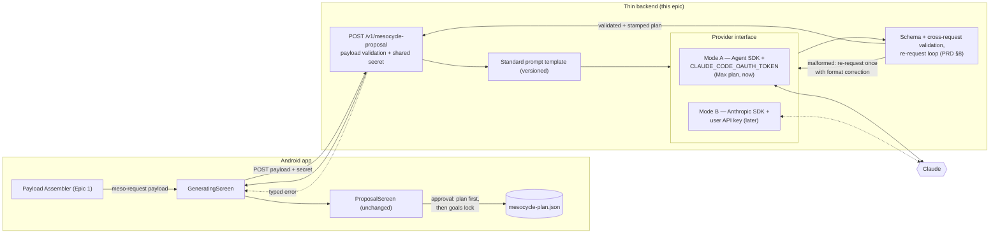

# Epic 2: Mesocycle Engine — Payload to LLM and Back

**Parent doc:** `design_handoff_cadentic_onboarding/cadentic_prd_v_1_1.md` (§5.3 Mesocycle Engine, §8 LLM integration, §9 step 4, §17)
**Depends on:** Epic 1 (meso-request payload, story 6; payload shape — Epic 1 open point 4 — must be resolved first)
**Status:** auth facts verified against official docs (2026-08-27); implementor-reviewed (3× *agree with changes*, all findings applied)

## Goal

Take the meso-request payload from Epic 1, send it with a **standard prompt** to an LLM, receive a proposed mesocycle back in strict JSON, validate it (re-request on garbled output), persist it as the **Mesocycle Plan artifact**, and feed it to the existing proposal UI — replacing the local `Engine.kt` stub with the real call.

**Definition of done:** tapping "generate" in the shipped onboarding produces a real LLM-generated mesocycle, billed to the owner's Claude Max plan, rendered in the existing ProposalScreen, and persisted as `mesocycle-plan.json` on approval. (Story 6's Mode B implementation is explicitly *not* required for Done — see story 6.)

## How the Max-plan authentication works (plain language)

Your Max plan is not an API key — it's your claude.ai account. But there is a sanctioned way to send prompts through it programmatically:

1. **Log in once, online.** Claude Code authenticates against your claude.ai account via OAuth (browser login). `claude setup-token` mints a **long-lived token** from that login, made for headless use.
2. **A tiny backend holds that token** (env var `CLAUDE_CODE_OAUTH_TOKEN`) and runs the **Claude Agent SDK** — Claude Code packaged as a library. Every `query()` it makes is billed to your Max subscription. No API key, no separate billing.
3. **The app never sees the token.** The Android app posts the payload to your backend; the backend asks Claude and returns the validated JSON. (A plan token inside an APK would be as leakable as a shipped API key — same rule as PRD §17.)
4. **Later, mode B:** a user enters their own Anthropic API key in the app; the same backend endpoint calls the Messages API with the official SDK instead. The engine sits behind a provider interface, so A→B is a config swap, not a rewrite.

Also exists, but not what you want: `ant auth login` OAuth profiles — same login-in-browser feel, but they bill a Console/API organization, not the Max plan.

**Verified against official docs (2026-08-27):**
- `claude setup-token` produces a **one-year** OAuth token (`sk-ant-oat01-…`), printed once — you copy it into the backend env as `CLAUDE_CODE_OAUTH_TOKEN`. Works with Pro/Max/Team/Enterprise ([code.claude.com/docs/en/authentication](https://code.claude.com/docs/en/authentication.md)).
- The Agent SDK headless with that token, billed to the subscription, **is officially supported** — with the stated constraint: **personal/dev use only**. Fine for your test app; a shipped multi-user product must not run on your plan token — that's exactly what Mode B is for.
- The **raw Messages API rejects subscription tokens** ("OAuth authentication is currently not supported", [claude-code#37205](https://github.com/anthropics/claude-code/issues/37205), closed not-planned). So Mode A **must** go through the Agent SDK — a raw HTTP shortcut will not work.
- There is **no official flow for end users to connect their own Max subscription** to a third-party app. Per-user billing means per-user API keys — Mode B is the only official path, not a temporary compromise.

Provider-agnosticism (PRD §8) is preserved **at the app-facing contract**: `POST /v1/mesocycle-proposal` is provider-blind, and a non-Anthropic provider would be a backend-only addition behind the same interface. Claude-only is a deliberate MVP narrowing.

## Proposed architecture

Happy path shown solid; typed errors dashed.



### Response schema (binding, sketch)

Per PRD §5.2 row 5 the plan holds: duration, phase structure, weekly distribution, day types, intra-/inter-week progression, deload timing — **never exercises**. Decisions recorded here (implementor may veto with reasons):

- **Day-type enum** pinned to PRD §5.1: `STRENGTH | ENDURANCE | MOBILITY | RECOVERY | REST`. Game/team-practice days are **overlaid by the GUI from the Blocker Calendar** — never authored by the LLM.
- **Intensity enum** reuses the Strain vocabulary: `LIGHT | MEDIUM | HARD` — one intensity language across the product.
- **Phases carry a `phaseType` enum** (`BASE | BUILD | PEAK | DELOAD`) that the UI switches on; `name` is display text only. Deload timing is expressed as a `DELOAD` phase — no separate deload field (single representation).
- **`headline` and `coachNote` are NOT in the LLM contract.** PRD §8: plan surfaces never render model free text. They stay deterministically composed from structured facts, exactly as `Engine.kt` does today (backend or client — implementor's pick).
- **`lane`, `focus`, `queued` are stamped by the backend from the request payload** — the model's echo is never trusted. The Goals artifact remains the single source of truth for priorities.
- `sessionsPerWeek` is in the schema and validated against `weeklyStructure` (training-day count); `laneLabel` and per-phase `weeksLabel` are client-derived.

```json
// mesocycle-plan.json — persisted on approval
{ "schemaVersion": 1, "updatedAt": "…",
  "generatedBy": { "mode": "max-plan-oauth", "model": "…", "promptVersion": 1 },
  "startDate": "2026-09-01", "endDate": "2026-10-26", "durationWeeks": 8,
  "sessionsPerWeek": 5,
  "lane": "LONGEVITY", "focus": ["CARDIO","EXPLOSIVENESS"], "queued": ["STRENGTH"],   // backend-stamped from payload
  "phases": [ { "phaseType": "BASE", "name": "Base", "weeks": 3 },
              { "phaseType": "BUILD", "name": "Build", "weeks": 3 },
              { "phaseType": "DELOAD", "name": "Deload", "weeks": 1 },
              { "phaseType": "PEAK", "name": "Peak", "weeks": 1 } ],
  "weeklyStructure": [ { "week": 1, "days": [ { "day": "MONDAY", "type": "STRENGTH", "intensity": "MEDIUM" } ] } ],
  "progression": { "intraWeek": "…", "interWeek": "…" } }
```

---

## User stories

### Story 0 — Provider interface + thin backend skeleton

As the **app**, I want one backend endpoint that accepts the meso-request payload and returns a validated mesocycle or a named error, so that the app never talks to an LLM provider directly.

**Acceptance criteria**
- `POST /v1/mesocycle-proposal` accepts the Epic 1 payload schema; rejects invalid payloads with the named-field errors from Epic 1 story 6. Payload and response schemas live as **one JSON Schema file** both app and backend validate against — no hand-mirrored enums.
- Every request carries a shared secret (header) checked by the backend; requests without it are refused. Dev server binds to the private network only.
- Auth mode (A/B) is backend config; the app request is identical in both modes. Selecting Mode B before story 6 ships returns the typed `provider-not-available` error.
- Typed errors: `payload-invalid`, `provider-unreachable`, `rate-limited` (with retry-after when available), `timeout`, `format-failed`, `auth-failed`, `provider-not-available` — never a raw stack trace to the app.
- Request timeout budget is explicit and ≥ worst-case generation including the re-request loop (client and backend aligned; multi-minute generations are expected).
- Backend language: implementor's pick of TypeScript or Python (the two Agent SDK languages).

### Story 1 — Standard prompt template

As the **Mesocycle Engine**, I want a versioned standard prompt that embeds the payload and demands strict JSON, so that every request is reproducible and the GUI stays deterministic (PRD §8).

**Acceptance criteria**
- Template versioned in the repo (`promptVersion` echoed into `generatedBy`).
- Embeds the payload verbatim; instructs: propose duration + phases + weekly day types/intensities + intra-/inter-week progression; **no exercises**; respond only with JSON matching the response schema.
- The template inserts the lane value from the payload verbatim and contains no lane-conditional prose of its own.

**Blocked on (owner):** the duration-band question (PRD §18). Interim behavior until answered: **no band constraint** in the prompt; whatever duration the LLM proposes is accepted (per your answer 5).

### Story 2 — Mode A: authenticate through the owner's Max plan

As the **owner**, I want the backend to call Claude via my Max subscription with a one-time online login, so that the test app runs without separate API billing.

**Acceptance criteria**
- One-time setup documented in the repo: `claude setup-token` → store as `CLAUDE_CODE_OAUTH_TOKEN` in backend env; **no `ANTHROPIC_API_KEY` set** (it would take precedence and bill the API instead).
- Backend calls the Claude Agent SDK headless (`query()`), receives the JSON answer, no interactive session. Not raw HTTP — the Messages API rejects subscription tokens.
- Token lives only in backend env/config — greppably absent from the Android app and never logged.
- Mode A refuses to start unless an explicit `MODE_A_PERSONAL_USE=true` flag is set (logged at startup), with the personal/dev-only constraint documented next to the flag. Mode B is mandatory for any deployment serving accounts other than the owner's.
- Expired/revoked token surfaces as typed `auth-failed` with the re-login instruction; a subscription usage-window hit surfaces as `rate-limited`.

### Story 3 — Response validation + re-request loop

As the **system**, I want every LLM answer validated against the response schema **and against the request**, with one corrective re-request on failure, so that malformed or invariant-breaking output never reaches the GUI (PRD §8).

**Acceptance criteria**
- Schema validation is **strict/closed**: unknown fields rejected (`additionalProperties: false`), day `type` restricted to the day-type enum — "never exercises" is machine-enforced, not prompt-hoped.
- Structural checks: enums (day type, intensity, phaseType, lane), `endDate` − `startDate` = `durationWeeks`, weeks contiguous, `sum(phases[].weeks)` = `durationWeeks`, `sessionsPerWeek` consistent with `weeklyStructure`.
- Cross-request checks: `startDate` within `[requestDate, requestDate + 14 days]` (window implementor-tunable — a validity check, not an app modification of the LLM's plan, so §9 step 4 / §15 stay satisfied); `lane`/`focus`/`queued` are backend-stamped from the payload, and a contradicting echo is treated as malformed.
- On malformed output: exactly one re-request appending the validation errors and the format instruction; second failure → typed `format-failed` to the app.
- Both attempts logged with `promptVersion` and raw response for debugging (backend-side only).

### Story 4 — Persist the Mesocycle Plan artifact *(depends on story 5 wiring)*

As the **athlete**, I want the approved proposal saved as the Mesocycle Plan artifact, so that the daily layer and tracker have the locked cycle to read (PRD §5.2 row 5).

**Acceptance criteria**
- On approval, **write order is fixed**: `mesocycle-plan.json` first, then the Epic 1 goals-lock snapshot minted **from the persisted plan artifact** — the lock write is the commit point the UI awaits (extends Epic 1 story 0's atomicity rule). *This amends Epic 1 story 3's lock source (was: the in-memory `Proposal`); Epic 1 carries a matching note.*
- Half-state rule: a plan artifact without a matching goals lock is treated as unapproved — discarded/overwritten on the next generate; hydration routes to the proposal flow, never to the approved state.
- Artifact survives restart; hydration (Epic 1 story 7) routes to the approved state with the persisted plan only when both writes exist.

### Story 5 — Swap the stub

As the **athlete**, I want the generate step to produce a real mesocycle, so that the proposal I approve was actually planned for me.

**Acceptance criteria**
- `Engine.kt`'s `ProposalEngine` is replaced by the backend call behind the same domain boundary; **ProposalScreen stays visually unchanged** (GeneratingScreen gains new states — below).
- Generation ordering: `generate()` awaits the step-3 artifact writes before payload assembly starts (no stale payload missing just-entered blockers).
- New failure handling: a failure state in the app's status machine (the current enum has none) + error slot on the draft, routed in `screenKey()`; a retry action re-invokes generation. The error/retry presentation is deliberately minimal (this screen is undesigned in the handoff — visual polish is out of scope).
- A client-side `backend-unreachable` state exists for app-cannot-reach-backend (airplane-mode test exercises **this**, not `provider-unreachable`, which means backend-cannot-reach-Claude and gets its own test with the backend up and Claude blocked).
- `back()` during GENERATING cancels the in-flight HTTP call; the backend request is cancelled too, or the endpoint is idempotent per request id (no double generation on retry).
- GeneratingScreen has a maximum-wait tied to the `timeout` error; app background/kill during generation lands the user back in the proposal flow with a clear state, never a silent DRAFT reset.
- Android networking prerequisites: `INTERNET` permission; **debug-only** network security config permitting cleartext to the dev host (never in release); backend base URL as a BuildConfig/debug setting (emulator `10.0.2.2` vs device LAN IP); chosen HTTP + JSON stack recorded.

### Story 6 — Mode B: user-entered API key *(later — all ACs below are the "later" set; the "now" half lives in story 0's provider-not-available error)*

As a **user**, I want to enter my own Claude API key, so that my usage bills to me and the owner's plan is never shared. (No official mechanism exists for users to connect their own Max subscription — an API key is the only per-user path.)

**Acceptance criteria**
- Settings field for the key; stored in Android Keystore-backed storage; never logged; sent only to the backend over TLS.
- Same endpoint contract as Mode A; provider interface selects the Messages API path (official Anthropic SDK, default model per backend config).
- Removing the key disables generation with a clear message; no silent fallback to the owner's plan.

---

## Open points for the implementor

1. Backend language (TypeScript vs Python) and hosting for the test phase (local dev machine reachable from the device is acceptable for MVP).
2. Cancel-propagation vs idempotent request ids for abandoned generations (story 5).
3. Mapping/extension of the Kotlin `Proposal` model to the response schema (per-day types, `phaseType`, derived `laneLabel`/`weeksLabel`).
4. Model + effort config per mode (Mode A: Agent SDK model options; Mode B: default `claude-opus-5`).
5. Where headline/coachNote composition lives (backend vs client — deterministic either way).
6. `startDate` validity window (default 14 days).

Note: Mode B routing is **backend-only**. A direct-from-app variant would duplicate the prompt template and validation client-side and break "A→B is a config swap" — it requires an owner decision, not an implementor one.

## Open questions for the product owner

- Duration band: constrain the LLM to 4–16 weeks in the prompt? Out-of-band answer: reject-and-re-request, or accept? (PRD §18; story 1 proceeds bandless until answered.)
- Long-term goals free text (carried from Epic 1): still unanswered; affects what the standard prompt can say about goals.
